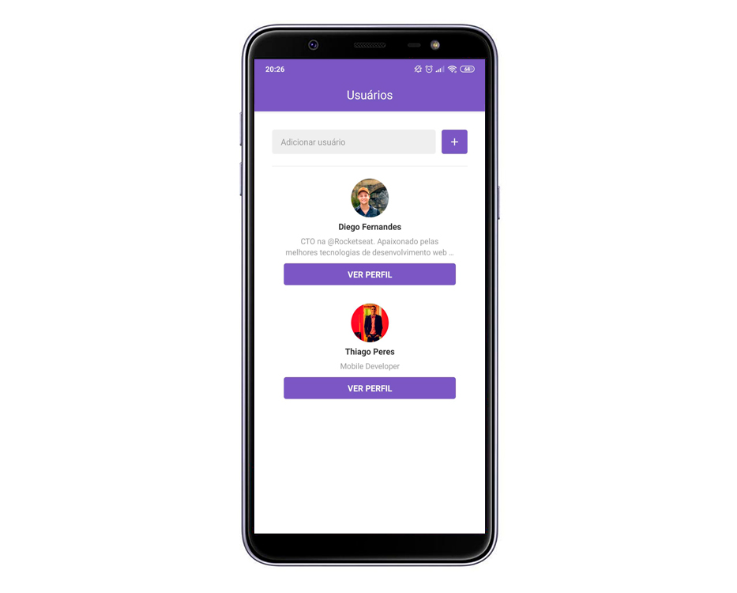
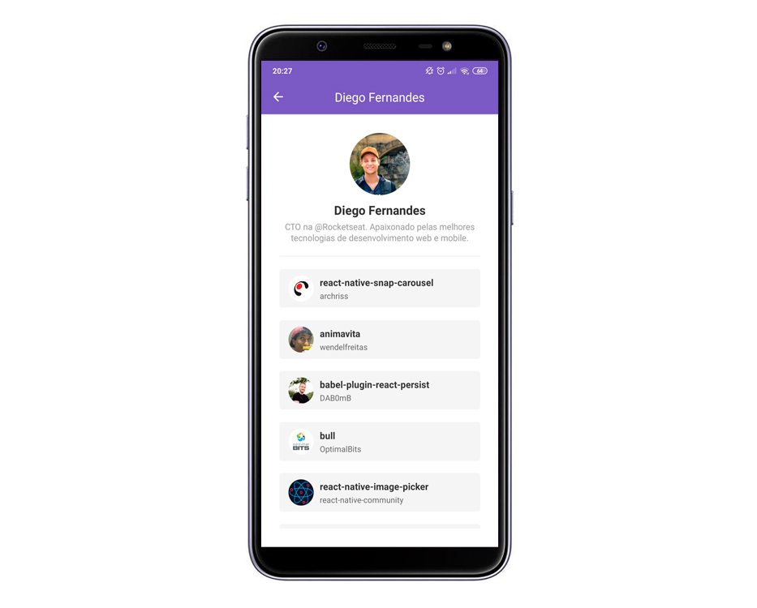
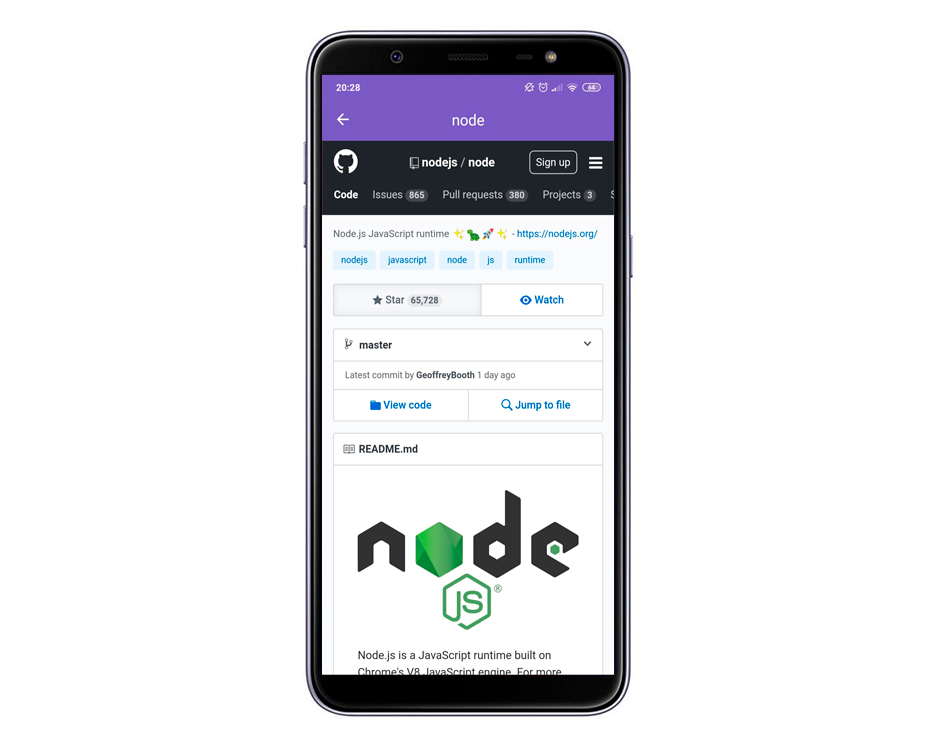

<h1 align="center">
    
</h1>

<h3 align="center">
  Primeiro projeto com React Native
</h3>

Código do sexto módulo do Bootcamp GoStack 🎓

  

  
  
  

  

## 💻 Projeto

O projeto consiste em adicionar usuários existentes no Github, através da API do Github, podendo visualizar os repositórios favoritados pelo usuário em uma lista e ao clicar no repositório pode visualizar suas informações numa WEBView.

Aplicação desenvolvida durante o Bootcamp GoStack, curso de capacitação online organizado pela [Rocketseat](https://rocketseat.com.br).

## 🚀 Tecnologias

Esse projeto foi desenvolvido com as seguintes tecnologias:

- [React Native](https://facebook.github.io/react-native/)

## 🚀 Instalação e execução

1. Faça um clone desse repositório;
2. Entre na pasta rodando `cd gostack-modulo6`;
3. Rode `yarn` para instalar as dependências;
4. Rode react-native run-ios ou react-native run-android dependendo do SO.

## 💻 Captura de Telas

#### Main

#### User

#### Repository

## :memo: Licença

Esse projeto está sob a licença MIT. Veja o arquivo [LICENSE](LICENSE.md) para mais detalhes.
